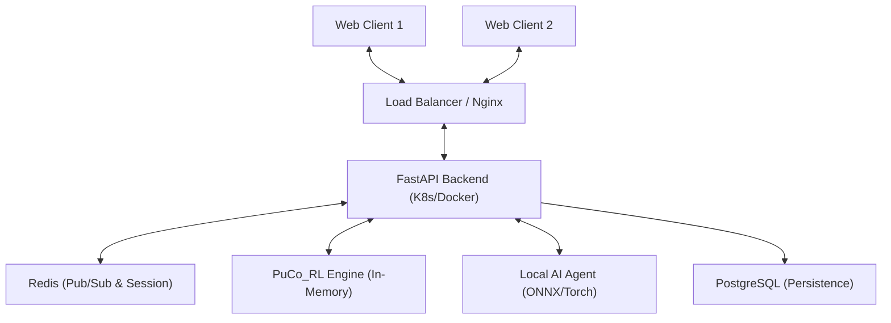

# Architecture: Castone Multiplayer & AI Backend

## 1. 시스템 컴포넌트 구조 (System Components)

Castone 백엔드는 고가용성과 실시간성을 위해 분산 가능한 구조로 설계되었습니다.

## 2. 데이터 흐름 (Data Flow)

### 2.1. 게임 액션 흐름 (Game Action Flow)
1. **Action Request**: 클라이언트가 WebSocket을 통해 `action_type`, `payload`를 전송.
2. **Validation**: `RoomManager`가 현재 턴 및 `action_mask`를 검증.
3. **Engine Execution**: `PuCo_RL` 엔진에서 상태 변화 수행.
4. **State Snapshot**: 변경된 게임 상태를 Redis에 캐싱.
5. **Broadcasting**: Redis Pub/Sub을 통해 해당 `game_id` 채널에 구독 중인 모든 클라이언트에게 신규 상태 전송.
6. **ML Logging**: `ml_logger`가 (S, A, R) 데이터를 비동기로 기록.

### 2.2. 봇 행동 알고리즘 (Bot Flow)
1. **Detection**: 인간 유저의 액션 완료 후, 다음 턴이 봇(`player_idx`)인 경우 트리거.
2. **Delay**: UX를 위해 2초 대기 (Asyncio Sleep).
3. **Context Prep**: `vector_obs`, `engine_instance`, `action_mask`, `phase_id`를 포함한 `game_context` 생성.
4. **Inference**: 로컬 `BotService`가 모델 추론 호출.
5. **Re-entry**: 추론된 액션을 다시 게임 액션 흐름(2.1)으로 진입시킴.

## 3. 기술 스택 (Tech Stack)
- **Framework**: FastAPI (Python 3.10+) - 비동기 I/O 최적화.
- **Real-time**: WebSockets + Redis Pub/Sub.
- **Database**: PostgreSQL (유저 및 전적), Redis (실시간 게임 세션 및 메시징).
- **AI Runtime**: ONNX Runtime (CPU) - 봇 추론 지연 최소화.
- **Worker**: Background Tasks (FastAPI 내장) 또는 Celery (확장 시).

## 4. 데이터베이스 설계 방향

### 4.1. Redis (In-Memory)
- `room:{game_id}:state`: 직렬화된 게임 상태 JSON.
- `room:{game_id}:mask`: 현재 유효한 액션 마스크.

### 4.2. PostgreSQL (Relational)
- `users`: 유저 정보, 랭크 점수.
- `games`: 게임 결과, 참여 플레이어 리스트, 모델 버전 정보.
- `game_logs`: 정밀 분석을 위한 액션 로그 매핑.

## 5. 보안 및 안정성
- **WebSocket ID**: 연결 시 JWT 기반 인증 수행.
- **Room Isolation**: 각 방은 고유한 `game_id`를 가지며, Redis Pub/Sub 채널로 완벽히 분리됨.
- **Engine Safety**: 엔진 오류 발생 시 마지막 Redis 스냅샷에서 복구하는 메커니즘 제공.
