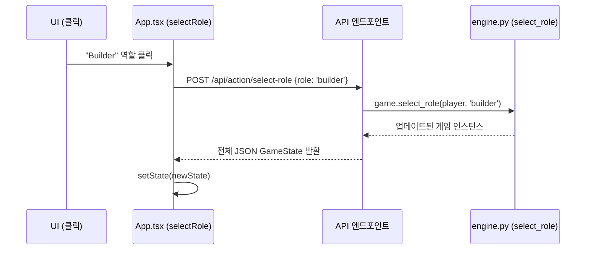

# puertorico 저장소 프론트엔드 분석 및 이식 전략 보고서

이 보고서는 `mcasetta/puertorico` 저장소의 프론트엔드 아키텍처를 분석하고, 이를 우리 프로젝트의 [engine.py](file:///Users/seoungmun/Documents/agent_dev/castone/PuCo_RL/env/engine.py)와 [API.md](file:///Users/seoungmun/Documents/agent_dev/castone/docs/API.md) 명세에 맞춰 이식하기 위한 전략을 담고 있습니다.

## 1. 상태 구조 분석

### [gameState.ts](file:///Users/seoungmun/Documents/agent_dev/castest/puertorico/frontend/src/types/gameState.ts)와 UI 컴포넌트 매핑

[frontend/src/types/gameState.ts](file:///Users/seoungmun/Documents/agent_dev/castest/puertorico/frontend/src/types/gameState.ts)에 정의된 [GameState](file:///Users/seoungmun/Documents/agent_dev/castest/puertorico/frontend/src/types/gameState.ts#195-203) 인터페이스는 단일 진실 공급원(Single Source of Truth) 역할을 합니다. 백엔드 응답을 직렬화하기 쉬운 평탄한 구조로 설계되어 있습니다.

| UI 컴포넌트 | 상태 매핑 ([GameState](file:///Users/seoungmun/Documents/agent_dev/castest/puertorico/frontend/src/types/gameState.ts#195-203)) | 주요 데이터 포인트 |
| :--- | :--- | :--- |
| **[CommonBoardPanel](file:///Users/seoungmun/Documents/agent_dev/castest/puertorico/frontend/src/components/CommonBoardPanel.tsx#41-139)** | `state.common_board` | 역할([roles](file:///Users/seoungmun/Documents/agent_dev/project1/PuertoRico-BoardGame-RL-Balancing/env/engine.py#150-160)), 식민자(`colonists`), 거래소(`trading_house`), 화물선(`cargo_ships`), 공개 농장(`available_plantations`) |
| **[PlayerPanel](file:///Users/seoungmun/Documents/agent_dev/castest/puertorico/frontend/src/components/PlayerPanel.tsx#21-108)** | `state.players[playerId]` | 더블론(`doubloons`), VP 칩(`vp_chips`), 물건(`goods`), 섬 타일(`island.plantations`), 도시 건물(`city.buildings`) |
| **`MetaPanel`** | `state.meta` | 라운드([round](file:///Users/seoungmun/Documents/agent_dev/project1/PuertoRico-BoardGame-RL-Balancing/env/engine.py#231-246)), 페이즈([phase](file:///Users/seoungmun/Documents/agent_dev/project1/PuertoRico-BoardGame-RL-Balancing/env/engine.py#213-230)), 활성 플레이어(`active_player`), 활성 역할([active_role](file:///Users/seoungmun/Documents/agent_dev/project1/PuertoRico-BoardGame-RL-Balancing/env/engine.py#404-407)) |

### [engine.py](file:///Users/seoungmun/Documents/agent_dev/castone/PuCo_RL/env/engine.py)와의 비교
우리의 [engine.py](file:///Users/seoungmun/Documents/agent_dev/castone/PuCo_RL/env/engine.py)([PuertoRicoGame](file:///Users/seoungmun/Documents/agent_dev/project1/PuertoRico-BoardGame-RL-Balancing/env/engine.py#13-934) 클래스)는 이미 이러한 상태의 대부분을 속성으로 보유하고 있습니다:
- `self.players`: [Player](file:///Users/seoungmun/Documents/agent_dev/castest/puertorico/frontend/src/types/gameState.ts#151-165) 객체 리스트.
- `self.common_board`: `self.goods_supply`, `self.cargo_ships`, `self.face_up_plantations`와 대응.
- `self.meta`: `self.current_phase`, `self.current_player_idx`, `self.active_role`과 대응.

**전략**: [engine.py](file:///Users/seoungmun/Documents/agent_dev/castone/PuCo_RL/env/engine.py)에 `to_dict()` 또는 `get_obs()` 메서드를 구현하여, Python 객체들을 [gameState.ts](file:///Users/seoungmun/Documents/agent_dev/castest/puertorico/frontend/src/types/gameState.ts)와 일치하는 JSON 구조로 변환합니다.

---

## 2. 페이즈 제어 (UX 로직)

### [App.tsx](file:///Users/seoungmun/Documents/agent_dev/castest/puertorico/frontend/src/App.tsx)의 하이라이트 및 스크롤 로직
[App.tsx](file:///Users/seoungmun/Documents/agent_dev/castest/puertorico/frontend/src/App.tsx)는 React `useEffect`를 사용하여 `state.meta.phase`와 `state.meta.active_player`를 모니터링합니다.

```typescript
// App.tsx 로직 요약
useEffect(() => {
  const targetId = getTargetSectionForPhase(state.meta.phase);
  const el = document.getElementById(targetId);
  if (el) {
    el.scrollIntoView({ behavior: 'smooth', block: 'center' });
    el.classList.add('focus-highlight'); // 하이라이트를 위한 CSS 애니메이션
    setTimeout(() => el.classList.remove('focus-highlight'), 1800);
  }
}, [state?.meta.phase, state?.meta.active_player]);
```

### 우리 프로젝트에 적용
- **페이즈 매핑**: `configs.constants.Phase` (Enum)를 프론트엔드에서 사용하는 `targetId` 문자열과 매핑합니다.
- **시각적 효과**: CSS에 `focus-highlight` 클래스(예: 일시적인 황금색 테두리 또는 펄스 효과)를 포함시킵니다.

---

## 3. 액션 처리 (API 상호작용)

### [puertorico](file:///Users/seoungmun/Documents/agent_dev/castest/puertorico)의 요청 흐름
[puertorico](file:///Users/seoungmun/Documents/agent_dev/castest/puertorico) 프론트엔드는 각 액션마다 별도의 엔드포인트를 사용합니다 (예: `/api/action/select-role`).



### [API.md](file:///Users/seoungmun/Documents/agent_dev/castone/docs/API.md)와의 정렬
우리의 [API.md](file:///Users/seoungmun/Documents/agent_dev/castone/docs/API.md)는 **통합 액션 엔드포인트**: `[POST] /game/action`을 규정하고 있습니다.

**매핑 전략**:
| [API.md](file:///Users/seoungmun/Documents/agent_dev/castone/docs/API.md) `action_type` | [engine.py](file:///Users/seoungmun/Documents/agent_dev/castone/PuCo_RL/env/engine.py) 메서드 | [puertorico](file:///Users/seoungmun/Documents/agent_dev/castest/puertorico) 액션 |
| :--- | :--- | :--- |
| `ROLE_SELECTION` | [select_role(player, role)](file:///Users/seoungmun/Documents/agent_dev/project1/PuertoRico-BoardGame-RL-Balancing/env/engine.py#318-379) | [selectRole(role)](file:///Users/seoungmun/Documents/agent_dev/castest/puertorico/frontend/src/App.tsx#559-582) |
| `BUILD` | [action_builder(player, building)](file:///Users/seoungmun/Documents/agent_dev/project1/PuertoRico-BoardGame-RL-Balancing/env/engine.py#640-684) | [requestBuild(name)](file:///Users/seoungmun/Documents/agent_dev/castest/puertorico/frontend/src/App.tsx#800-803) |
| `PLANT` | [action_settler(player, tile_index)](file:///Users/seoungmun/Documents/agent_dev/project1/PuertoRico-BoardGame-RL-Balancing/env/engine.py#537-585)| [settlePlantation(type)](file:///Users/seoungmun/Documents/agent_dev/castest/puertorico/frontend/src/App.tsx#629-640) |
| `MAYOR_DISTRIBUTE` | [action_mayor_pass(player, island, city)](file:///Users/seoungmun/Documents/agent_dev/project1/PuertoRico-BoardGame-RL-Balancing/env/engine.py#586-639) | [mayorFinishPlacement()](file:///Users/seoungmun/Documents/agent_dev/castest/puertorico/frontend/src/App.tsx#680-695) |

---

## 4. 최종 이식 전략 요약

> [!IMPORTANT]
> [puertorico](file:///Users/seoungmun/Documents/agent_dev/castest/puertorico) 저장소와 같은 수준의 완성도를 얻으려면 프론트엔드의 **반응성(Reactive nature)**에 집중해야 합니다: 모든 액션은 전체 상태 갱신을 유발해야 합니다.

1.  **상태 동기화**: 백엔드(FastAPI/Pydantic)에 [frontend/src/types/gameState.ts](file:///Users/seoungmun/Documents/agent_dev/castest/puertorico/frontend/src/types/gameState.ts)를 거울처럼 반영하는 [GameState](file:///Users/seoungmun/Documents/agent_dev/castest/puertorico/frontend/src/types/gameState.ts#195-203) 스키마를 생성합니다.
2.  **통합 액션 디스패처**: [API.md](file:///Users/seoungmun/Documents/agent_dev/castone/docs/API.md) 형태의 액션을 받아 적절한 [engine.py](file:///Users/seoungmun/Documents/agent_dev/castone/PuCo_RL/env/engine.py) 메서드를 호출하는 라우터를 구현합니다.
3.  **프론트엔드 스캐폴딩**:
    - [puertorico](file:///Users/seoungmun/Documents/agent_dev/castest/puertorico)의 컴포넌트 구조([CommonBoardPanel](file:///Users/seoungmun/Documents/agent_dev/castest/puertorico/frontend/src/components/CommonBoardPanel.tsx#41-139), [PlayerPanel](file:///Users/seoungmun/Documents/agent_dev/castest/puertorico/frontend/src/components/PlayerPanel.tsx#21-108))를 활용합니다.
    - 자동 스크롤 및 하이라이트를 위해 [App.tsx](file:///Users/seoungmun/Documents/agent_dev/castest/puertorico/frontend/src/App.tsx)의 페이즈 트래킹 로직을 도입합니다.
    - 멀티플레이어 또는 AI 사고 페이즈의 상태 동기화를 위해 WebSocket([API.md](file:///Users/seoungmun/Documents/agent_dev/castone/docs/API.md) 기반) 또는 숏 폴링([puertorico](file:///Users/seoungmun/Documents/agent_dev/castest/puertorico) 방식)을 사용합니다.

