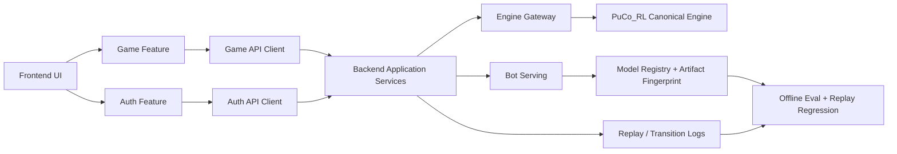

# 오류 로그 기반 설계 보고서

작성일: 2026-04-08  
기준 입력:
- `error_logs.md`
- 현재 저장소 구조 및 관련 코드 경로
- `brainstorming`, `mlops-engineer`, `test-driven-development` 관점

## 1. Understanding Summary

- main 브런치의 initial import 라는 커밋으로 롤백한 후, PuCo_RL의 최신 폴더인 
https://github.com/dae-hany/PuertoRico-BoardGame-RL-Balancing.git 이 저장소를 가져와서 그 저장소를 건들지 말고,
backend에서 wrapper하는 형태로 받기를 원해
- 현재 사람 플레이어의 mayor페이즈는 기존의 순차 방식으로 봇은 새로운 전략 방식으로 배치하고 있는데
- 이걸 사람 플레이어도 매 mayor 페이즈마다 전략 방식으로 배치하는 형태로 ui,backend 등을 수정하는 형태로
- frontend 역시 사람 플레이어가 Mayor phase에서 slot-by-slot 배치가 아니라 전략 선택 UI를 사용하도록 바꿔야 하며, 기존 legacy Mayor UI/파일은 유지하지 않는다.


- 현재 문제는 단일 버그가 아니라 `인증/프론트 노이즈`, `Google OAuth 환경설정`, `PPO 행동 품질`, `엔진-백엔드-프론트 결합도`가 동시에 얽힌 구조 문제다.
- 사용자가 원하는 방향은 단순 패치보다 큰 방향 전환에 가깝다. 특히 Mayor phase는 사람/봇 모두 전략 기반으로 통일하고, `PuCo_RL`을 canonical engine으로 두고 backend는 얇게 래핑하는 구조를 원한다.
- 따라서 이번 변경은 dual-mode 장기 공존이 아니라, upstream engine 기준으로 한 번에 컷오버하는 방향이 더 맞다.
- 현재 코드베이스는 한 파일이 여러 책임을 동시에 가져서 변경 시 필요한 컨텍스트 범위가 넓다. 이 때문에 AI 작업 비용과 토큰 사용량이 커지고, 안전한 수정도 어려워진다.
- RL 관점에서는 "학습 평가에서는 이기는데 실제 시각화에서는 크게 진다"는 현상이 핵심 리스크다. 이는 보상 설계 문제일 수도 있지만, 더 먼저 의심해야 할 것은 train/serve/eval drift다.
- 프론트 인증 로그 중 일부는 실제 장애가 아니라 예상 가능한 상태 전이에서 발생하는 noisy signal일 가능성이 높다. 반면 Google origin mismatch는 실제 설정 오류다.
- 목표는 기능을 한 번에 갈아엎는 것이 아니라, 구조 경계를 먼저 세워서 변경 범위를 국소화하고, 그 위에서 Mayor semantics와 MLOps 신뢰성을 순차적으로 정리하는 것이다.

## 2. Assumptions

- `GET /api/puco/auth/me`의 `401`은 "토큰 없음/만료/무효"에 대한 정상적인 서버 응답이며, 현재 사용자 체감 문제는 API 의미보다도 프론트 부트스트랩 UX와 콘솔 노이즈에 가깝다.
- `accounts.google.com ... 403`과 `[GSI_LOGGER]: The given origin is not allowed for the given client ID.`는 백엔드 버그가 아니라 Google OAuth Client 설정 불일치다.
- `Cross-Origin-Opener-Policy policy would block the window.postMessage call.` 경고는 Google Identity popup/prompt 과정에서 흔히 보이는 브라우저 경고일 수 있으며, 로그인 자체가 실패하지 않는다면 우선순위는 낮다.
- 저장소는 이미 Mayor/adapter/model serving 리팩토링이 진행 중인 작업 트리이며, 본 문서는 그 중간 상태를 전제로 한 점진적 설계를 제안한다.
- 런타임 핫패스는 `engine.step()`, action mask 계산, state serialization, bot inference, websocket broadcast다. 이 경로에는 불필요한 추상화나 deep copy를 넣지 않는다.

## 3. 현재 관찰

### 3.1 사용자 로그 해석

| 관찰된 로그 | 해석 | 우선순위 |
|---|---|---|
| `/api/puco/auth/me 401` | stale token 또는 무효 토큰 확인 과정일 가능성이 큼. API semantics 자체는 맞다. | 중 |
| `The given origin is not allowed for the given client ID` | Google OAuth authorized JavaScript origin 설정 누락/불일치. 실제 설정 오류. | 높음 |
| `Cross-Origin-Opener-Policy ... postMessage` | 브라우저/Google SDK 경고 가능성 큼. 로그인 실패 여부와 분리해 다뤄야 함. | 낮음 |
| PPO가 거의 매 라운드 상인 선택 | reward misalignment 또는 policy drift 가능성 | 높음 |
| 5원이 있는 역할을 고르지 않음 | role-value 계산, observation drift, action mask/role encoding drift 가능성 | 높음 |
| 학습에서는 ActionValue bot에 75% 승리, 시각화에서는 크게 패배 | train/serve/eval 환경 불일치 가능성 매우 높음 | 매우 높음 |

### 3.2 코드베이스 구조 신호

실제 코드 길이와 역할 집중도는 이미 구조적 병목을 보여준다.

| 파일 | 라인 수 | 현재 문제 |
|---|---:|---|
| `frontend/src/App.tsx` | 1779 | auth bootstrap, routing, multiplayer UI, game UI, mayor UI가 한 파일에 혼재 |
| `backend/app/services/state_serializer.py` | 659 | 엔진 표현, UI 표현, action translation, safety guard가 한 모듈에 집중 |
| `backend/app/services/game_service.py` | 579 | room lifecycle, engine orchestration, replay, turn validation, model snapshot이 한곳에 혼재 |
| `backend/app/services/model_registry.py` | 372 | artifact metadata, bootstrap inference, env introspection이 섞여 있음 |
| `backend/app/services/bot_service.py` | 308 | inference 준비, action guard, Mayor 예외 처리, UX delay, callback orchestration이 섞여 있음 |

### 3.3 이미 존재하는 좋은 신호

- `frontend/src/__tests__/App.auth-flow.test.tsx`는 인증 부트스트랩의 핵심 happy path와 stale token 처리를 이미 검증하고 있다.
- `backend/tests/test_auth.py`는 `/api/puco/auth/me`가 인증 없을 때 `401`을 반환해야 함을 명시한다.
- `backend/tests/test_serving_ppo_wrapper.py`와 `backend/tests/test_model_registry_bootstrap.py`는 `210 ↔ 211 obs_dim` drift를 이미 문제로 인식하고 있다.
- `PuCo_RL/tests/test_mayor_strategy_mapping.py`는 "인간 배치를 전략으로 매핑"하는 TDD-style 테스트 자산으로 재활용 가치가 높다.

## 4. 핵심 문제 정의

### 문제 1. 인증 상태와 인증 설정 오류가 같은 계층에서 섞여 보인다

현재 프론트는 `App.tsx`에서 토큰 검증, 로그인, 닉네임 설정, 화면 전환을 모두 처리한다. 이 구조에서는 `401` 같은 정상적인 상태 전이도 개발자 콘솔에서 "에러"처럼 보이고, Google origin mismatch 같은 실제 설정 오류와 구분이 어렵다.

### 문제 2. Mayor semantics가 여러 계층에 중복 표현되어 drift를 만든다

현재 저장소에는 sequential Mayor 흔적, strategy Mayor 흔적, adapter 흔적이 동시에 있다. 이 상태는 프론트, 백엔드, 엔진, 테스트가 서로 다른 Mayor 계약을 참조할 위험이 크다.

### 문제 3. MLOps 관점에서 모델 lineage가 아직 충분히 강하지 않다

현재도 `model_versions` snapshot과 bootstrap metadata는 있으나, "이 체크포인트가 어떤 observation/action space/mayor semantics/reward weights에서 학습되었는가"를 end-to-end로 강제하지는 못한다. 이 때문에 학습 평가와 실제 시각화가 다른 세계에서 실행될 수 있다.

### 문제 4. 변경 비용이 모듈 경계 부재에서 발생한다

핵심 서비스가 거대한 파일로 묶여 있고 `sys.path` 기반 `PuCo_RL` 직접 참조가 넓게 퍼져 있다. 결과적으로 작은 수정도 광범위한 컨텍스트를 읽어야 하며, 이는 사람과 AI 모두에게 비싸다.

## 5. 설계 대안

### 대안 A. 최소 패치

- Google OAuth origin만 고친다.
- App의 auth bootstrap만 소폭 손본다.
- PPO 이상 현상은 실험적으로만 본다.

장점:
- 가장 빠르다.

단점:
- Mayor drift, MLOps drift, 구조적 결합 문제를 해결하지 못한다.
- "왜 train에서는 이기고 실제에서는 지는가"를 다시 반복해서 겪게 된다.

### 대안 B. upstream canonical engine 일괄 반영 + backend/frontend 재정렬

- `PuCo_RL`을 canonical domain/engine으로 둔다.
- upstream 전체를 `PuCo_RL`에 반영한 뒤, 이후 `PuCo_RL`은 engine 패키지로 고정한다.
- backend는 engine adapter와 application service로 분리한다.
- Mayor는 사람/봇 모두 strategy semantics로 통일하고, frontend도 동일한 전략 선택 UI로 전환한다.
- MLOps에서는 artifact fingerprint와 evaluation gate를 먼저 세운다.

장점:
- 사용자가 원하는 방향과 가장 잘 맞는다.
- drift를 줄이고 변경 범위를 국소화한다.
- 점진 적용이 가능하다.

단점:
- 초기 설계 작업이 필요하다.
- sequential Mayor 흔적을 정리하는 과도기가 필요하다.

### 대안 C. 한 번에 upstream 완전 교체

- 현재 backend/frontend 계약을 크게 바꾸고 곧바로 upstream semantics에 맞춘다.

장점:
- 최종 구조로 빠르게 도달할 수 있다.

단점:
- 현재 작업 트리 상황에서 회귀 위험이 너무 크다.
- TDD 없이 진행하면 문제 원인을 잃는다.

## 6. 권장 결정

권장안은 **대안 B**다.

핵심 결정은 다음과 같다.

1. `PuCo_RL`을 canonical engine으로 두고 backend는 thin adapter로 수렴한다.
2. Mayor phase semantics는 최종적으로 사람/봇 모두 `strategy-first`로 통일한다.
3. frontend의 human Mayor UI도 strategy choice 기반으로 바꾸고, slot-by-slot legacy UI는 제거한다.
4. 기존 sequential Mayor API/serializer/orchestrator는 남기지 않고, engine 컷오버와 함께 제거한다.
5. `401 /auth/me`의 의미는 유지한다. 대신 프론트 bootstrap과 설정 검증 계층을 분리해 noisy failure를 줄인다.
6. 모델 승격은 artifact metadata + environment fingerprint + evaluation gate를 통과한 경우에만 허용한다.

## 7. 목표 아키텍처



## 8. 상세 설계

### 8.1 Frontend 설계

#### 목표

- `App.tsx`를 화면 오케스트레이션으로 축소한다.
- 인증 설정 문제와 인증 상태 전이를 분리한다.
- Mayor UI를 전략 선택 UI로 전환할 준비를 한다.

#### 제안 구조

```text
frontend/src/
  app/
    AppShell.tsx
    AppRouter.tsx
    bootstrapAuth.ts
  features/
    auth/
      api.ts
      session.ts
      config.ts
      AuthGate.tsx
      GoogleLoginCard.tsx
    mayor/
      MayorStrategyPanel.tsx
      mayorStrategyPreview.ts
      mayorStrategyLabels.ts
    game/
      useGameScreenState.ts
      useRoomFlow.ts
      api.ts
```

#### 설계 포인트

- `bootstrapAuth.ts`는 "토큰이 있으면 검증, 없으면 login screen"만 담당한다.
- `config.ts`는 `VITE_GOOGLE_CLIENT_ID` 존재 여부와 현재 실행 모드에서 필요한 설정을 검증한다.
- `AuthGate.tsx`는 `401`을 "예상 가능한 unauthenticated transition"으로 처리하고 UI 노이즈를 줄인다.
- `MayorStrategyPanel.tsx`는 `CAPTAIN_FOCUS`, `TRADE_FACTORY_FOCUS`, `BUILDING_FOCUS` 세 전략과 미리보기 설명을 보여준다.
- 사람 플레이어가 Mayor phase에 진입하면 기존 분배 토글 UI 대신 전략 카드/버튼을 보고 하나를 선택한다.
- 선택 즉시 backend에 strategy action 하나만 전달하며, 프론트는 더 이상 `mayor_slot_idx`나 per-slot pending state를 관리하지 않는다.

#### 중요한 결정

`/api/puco/auth/me`를 `200 { authenticated: false }`로 바꾸지 않는다.  
이 엔드포인트는 계속 보호된 리소스여야 하며, noisy console 문제는 프론트 bootstrap 구조로 해결한다.

### 8.2 Backend 설계

#### 목표

- application service와 engine boundary를 분리한다.
- serializer를 기능별로 나눠 프론트 표현과 엔진 표현 사이에 안정된 adapter를 만든다.
- Mayor sequential 흔적을 격리한다.

#### 제안 구조

```text
backend/app/
  services/
    game_runtime/
      room_lifecycle.py
      turn_executor.py
      actor_resolution.py
      replay_facade.py
    engine_gateway/
      protocol.py
      puco_engine.py
      state_views.py
      action_masks.py
      mayor_strategy.py
    auth/
      session_bootstrap.py
      google_config.py
```

#### 역할 재배치

- `game_service.py`
  - 유지: 상위 facade
  - 분리: room 시작/종료, actor validation, replay snapshot, turn execution
- `state_serializer.py`
  - 분리: common board serializer, player serializer, meta serializer, mask guard
- `bot_service.py`
  - 분리: inference input build, policy call, post-action orchestration
- `mayor_orchestrator.py`
  - sequential Mayor 전용 파일이므로 컷오버와 함께 제거 대상

### 8.3 Mayor phase 통일 설계

#### 최종 방향

- 사람과 봇 모두 같은 Mayor semantics를 사용한다.
- canonical action은 strategy choice이며, sequential slot distribution은 코드베이스에서 제거한다.

#### 이유

- 학습 환경과 실제 게임 환경을 맞출 수 있다.
- 사람/봇 이중 규칙을 없애서 drift를 줄인다.
- 프론트와 백엔드가 24-slot 분배 상태를 직접 들고 있을 필요가 줄어든다.

#### 전환 원칙

- dual-mode를 런타임에 오래 유지하지 않는다.
- migration branch에서 backend/frontend를 함께 맞춘 뒤 한 번에 cutover한다.
- cutover 이후에는 human/bot 공통으로 strategy action만 사용한다.

#### UI 원칙

- 전략 기반으로 바뀌더라도 "왜 이 전략이 이런 배치를 만드는지"를 보여줘야 한다.
- 따라서 slot-by-slot 조작을 유지하는 대신, strategy preview를 상세하게 제공하는 쪽이 더 낫다.
- 프론트에서 legacy Mayor 배치 상태를 별도로 흉내 내지 않는다.

### 8.4 MLOps 설계

#### 문제 정의

현재 가장 위험한 신호는 "학습에서는 우세, 실제 시각화에서는 열세"다.  
이 문제는 reward tuning보다 먼저 **artifact/environment drift**를 의심해야 한다.

#### 필수 artifact fingerprint

각 모델 artifact는 최소한 아래 정보를 가져야 한다.

- `artifact_name`
- `checkpoint_sha256`
- `family`
- `architecture`
- `obs_dim`
- `action_dim`
- `num_players`
- `potential_mode`
- `reward_weights`
- `action_space_version`
- `mayor_semantics_version`
- `training_script`
- `env_module`
- `opponent_pool_version`
- `metadata_source`

현재 `bootstrap_derived` metadata는 임시 호환 수단으로 허용하되, 새 실험부터는 sidecar JSON을 기본으로 강제하는 것이 맞다.

#### 평가 게이트

모델 승격은 아래 4단계를 통과해야 한다.

1. **Compatibility Gate**
   - obs_dim, action_dim, action space version, mayor semantics version 일치 여부 확인
   - 실패 시 서빙 금지

2. **Offline Head-to-Head Gate**
   - `random`, `rule_based`, `action_value` 상대로 고정 시드 매치
   - 기존 champion 대비 최소 승률 기준 통과

3. **Scenario Regression Gate**
   - 상인 과선호
   - 5 doubloon 역할 무시
   - Mayor strategy 왜곡
   - known bad replay 재현 실패 여부

4. **Replay Parity Gate**
   - 학습 평가에 사용한 checkpoint와 실제 visualization/serving checkpoint가 동일한 artifact fingerprint인지 검증

#### 권장 운영 자산

- `replay_logger`에 `action_space_version`, `mayor_semantics_version`, `artifact fingerprint`를 추가
- 평가 결과를 markdown이 아니라 machine-readable JSON으로도 남김
- 승격 대상 모델마다 "왜 승격되었는가" decision log를 저장

### 8.5 TDD 설계

#### 원칙

- 새 동작 추가 전 반드시 failing test를 먼저 만든다.
- 한 단계는 하나의 계약만 바꾼다.
- behavior change와 structural refactor를 동시에 하지 않는다.

#### 단계별 테스트 전략

| 단계 | 먼저 깨져야 하는 테스트 | 구현 대상 |
|---|---|---|
| Auth bootstrap 정리 | `frontend/src/__tests__/App.auth-flow.test.tsx` 확장 | stale token noise 감소, config banner |
| Google config 검증 | 신규 `backend/tests/test_google_oauth_config.py` | 설정 health/config 응답 |
| Model fingerprint 강제 | `backend/tests/test_model_registry_bootstrap.py` 확장 | sidecar 우선 정책, fingerprint 노출 |
| Serving parity | `backend/tests/test_serving_ppo_wrapper.py` 확장 | obs/action/mayor version mismatch 차단 |
| Mayor strategy contract 도입 | 신규 `backend/tests/test_mayor_strategy_contract.py` | human/bot 공통 strategy contract |
| Human Mayor UI 전환 | 신규 `frontend/src/components/__tests__/MayorStrategyPanel.test.tsx` | 사람 플레이어 strategy UX |
| Engine semantics 통일 | `PuCo_RL/tests/test_mayor_strategy_mapping.py` 및 관련 engine tests | strategy-first canonical behavior |
| Legacy 제거 검증 | legacy endpoint/UI 테스트 삭제와 계약 테스트 갱신 | old sequential contract cleanup |

#### Behavioral regression 시나리오

새로 필요한 회귀 테스트는 최소 아래 세 가지다.

1. **Trader Over-selection Scenario**  
   - 상인을 선택해도 기대값 이점이 없는 상태에서 다른 역할을 우선해야 한다.

2. **High Doubloon Role Priority Scenario**  
   - 5 doubloon이 쌓인 역할이 즉시 가치가 높다면 선택해야 한다.

3. **Train vs Visualization Parity Scenario**  
   - 동일 checkpoint, 동일 seed, 동일 env fingerprint에서 offline eval과 replay visualization 결과가 통계적으로 크게 어긋나면 실패해야 한다.

## 9. 점진 적용 순서

### Phase 0. 연결관계 맵 작성

- 현재 backend/frontend가 `PuCo_RL` 내부 어떤 모듈과 속성에 직접 기대고 있는지 목록화한다.
- 컷오버 시 반드시 함께 바꿔야 하는 contract를 명시한다.
- AI 비용 감소 이유:
  - 엔진 교체 영향 범위를 먼저 좁혀 이후 작업에서 불필요한 탐색을 줄인다.

### Phase 1. upstream 반영 및 `PuCo_RL` 고정

- `initial import` 기준에서 upstream 전체를 `PuCo_RL`로 반영한다.
- 이후 `PuCo_RL`은 engine 패키지로 간주하고 직접 수정하지 않는다.
- AI 비용 감소 이유:
  - 이후 변경은 backend/frontend wrapper 쪽으로 한정된다.

### Phase 2. backend wrapper 정렬

- backend 내부에서 `PuCo_RL` 직접 참조를 `engine_gateway` 아래로 모은다.
- `mayor_orchestrator`, sequential Mayor endpoint, legacy action translation을 제거한다.
- AI 비용 감소 이유:
  - 엔진 관련 수정은 gateway와 engine 계약만 보면 된다.

### Phase 3. frontend strategy UI 전환

- 사람 플레이어 Mayor UI를 strategy choice UI로 전환한다.
- `mayor_slot_idx`, pending distribution, slot toggle 기반 상태를 제거한다.
- AI 비용 감소 이유:
  - Mayor 관련 프론트 수정 시 거대한 토글/분배 상태를 더 이상 추적하지 않아도 된다.

### Phase 4. MLOps gate 도입

- artifact fingerprint, evaluation gate, replay parity를 추가한다.
- AI 비용 감소 이유:
  - PPO 이상 현상을 디버깅할 때 코드 추측보다 metadata와 평가 결과를 먼저 볼 수 있다.

### Phase 5. 계약 정리

- `contract.md`, frontend 타입, backend serializer를 strategy-first contract로 정리한다.
- legacy Mayor 관련 파일과 테스트는 코드베이스에서 제거한다.

## 10. 성능 민감 경로

다음 경로는 리팩토링 시 성능 민감 경로로 별도 표시해야 한다.

- `backend/app/engine_wrapper/wrapper.py`의 `step()` 호출 경로
- `backend/app/services/state_serializer.py`에서 매 turn 실행되는 serialization
- `backend/app/services/bot_service.py`의 observation flatten + inference 준비
- websocket/state broadcast 경로
- replay logging 경로

### 성능 규칙

- request/turn 단위로 큰 dict deep copy 금지
- serializer는 필요한 필드만 생성
- obs flatten shape 계산은 캐시 유지
- Mayor preview 계산은 UI 렌더 때마다 하지 말고 action candidate 생성 시 캐시
- drift 분석용 deep copy/simulation은 offline eval 또는 explicit debug path에서만 수행

## 11. AI 작업 비용과 토큰 비용이 줄어드는 이유

1. 인증 수정은 `features/auth`만 보면 되게 된다.
2. Mayor 수정은 `engine_gateway/mayor_strategy.py`와 관련 serializer/UI만 보면 되게 된다.
3. PPO serving 문제는 `model_registry`, `bot_service`, `evaluation gate` 세 축으로 좁혀진다.
4. giant file를 분할하면 diff review와 회귀 범위가 줄어든다.
5. canonical engine boundary가 생기면 backend가 엔진 내부 표현 변화를 직접 따라다니지 않아도 된다.
6. legacy Mayor를 안 남기면 dual semantics를 동시에 머리에 들고 있을 필요가 없다.

## 12. Decision Log

### D1. `/api/puco/auth/me`의 401 semantics는 유지한다

- 대안: unauthenticated도 200으로 래핑
- 선택 이유: 보호 리소스 의미를 유지하는 편이 낫고, 문제는 API semantics보다 bootstrap UX다.

### D2. Mayor는 최종적으로 사람/봇 공통 strategy semantics로 통일한다

- 대안: 인간은 sequential, 봇만 strategy 유지
- 선택 이유: 학습/서빙/실게임 의미를 맞추고 drift를 줄이기 위해서다.

### D3. `PuCo_RL`을 canonical engine으로 두고 backend/frontend는 여기에 맞춘다

- 대안: backend 서비스가 계속 엔진 내부 세부사항을 직접 참조
- 선택 이유: 변경 범위 국소화와 upstream 정합성 확보에 유리하다.

### D4. legacy Mayor 파일/계약은 남기지 않는다

- 대안: migration 편의를 위해 sequential compatibility layer 유지
- 선택 이유: dual-mode를 남기는 순간 semantics drift와 문서 부채가 다시 생긴다.

### D5. 새 모델은 sidecar metadata 중심으로 관리한다

- 대안: bootstrap-derived metadata에 계속 의존
- 선택 이유: 실험 lineage와 serving parity를 강하게 보장하려면 명시적 metadata가 필요하다.

### D6. 리팩토링은 연결관계 파악 → upstream 고정 → wrapper 정렬 → UI 컷오버 순서로 진행한다

- 대안: 부분 호환 레이어를 오래 유지하며 천천히 이전
- 선택 이유: 이번 작업의 본질은 engine 통합이므로, 한 번의 명확한 cutover가 오히려 더 안전하다.

## 13. Open Questions

- 인간 Mayor UI는 "전략 3개 버튼 + 프리뷰"로 충분한가, 아니면 설명 가능한 세부 배치 근거까지 노출해야 하는가?
- visualization에서 사용하는 checkpoint가 offline eval과 정말 동일한 artifact fingerprint인가?
- Google 로그인은 local dev에서 반드시 real OAuth를 써야 하는가, 아니면 `DEBUG=true`일 때 mock login을 더 적극 활용할 것인가?
- ActionValue bot과 PPO의 비교 기준은 승률만 볼 것인가, 아니면 role selection quality / economy efficiency 같은 중간 지표도 함께 볼 것인가?

## 14. 최종 제안

가장 안전하고 효과적인 방향은 다음 한 줄로 정리된다.

> **"auth/config 문제는 분리 진단하고, `PuCo_RL`을 canonical engine으로 세우고, Mayor semantics를 strategy-first로 통일하며, 모델 승격은 fingerprint와 replay parity를 통과한 경우에만 허용한다."**

이 순서로 가면 구조 개선과 행동 품질 개선을 동시에 추적할 수 있고, 앞으로 특정 기능 수정 시 "어느 파일만 보면 되는지"가 지금보다 훨씬 명확해진다.
