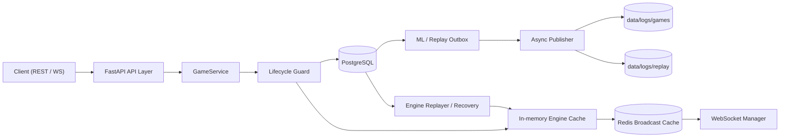
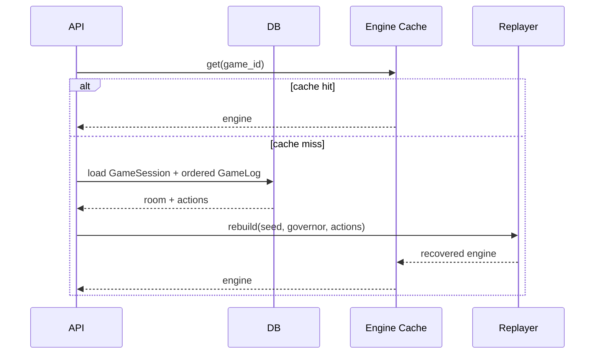
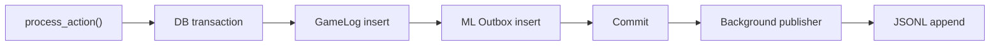

# 오류 우선순위 및 해결 설계서

작성일: 2026-04-05
기준 문서:

- `docs/docker_test_report_2026-04-05.md`
- 사전 코드 리뷰 findings

## 목적

이 문서는 현재 코드베이스의 오류를 시니어 아키텍처 관점에서 우선순위화하고, TDD 원칙에 따라 어떤 순서로 어떻게 고쳐야 하는지 정리한 실행 설계서입니다.

포함 범위:

- 우선순위 정리
- 아키텍처 관점의 원인 분석
- TDD 기반 해결 순서
- 제안 코드 스니펫
- 목표 설계도

## 시니어 아키텍처 관점의 기본 원칙

현재 문제들을 개별 버그로만 보면 수정이 산발적으로 흩어질 가능성이 큽니다. 시니어 아키텍처 관점에서는 아래 원칙을 먼저 고정해야 합니다.

### 원칙 1. 상태의 정본은 하나여야 한다

- `DB status`
- `in-memory engine`
- `Redis cache`
- `JSONL / replay log`

이 네 군데가 서로 다른 진실을 가지면 운영 장애가 반복됩니다.

권장 방향:

- 게임 lifecycle의 정본은 `DB + 재생 가능한 이벤트 로그`로 두고,
- 메모리 엔진은 캐시 또는 실행기 역할로 한정합니다.

### 원칙 2. 종료 상태는 강한 불변식이어야 한다

`FINISHED`가 되었으면 더 이상 액션이 들어가면 안 됩니다.

권장 방향:

- 모든 write path에서 `room.status == "PROGRESS"`를 강제합니다.
- 종료 후 상태 변경은 명시적 관리자 작업이나 복구 절차로만 허용합니다.

### 원칙 3. 부수효과는 commit 이후에 내보내야 한다

- WebSocket broadcast
- JSONL 기록
- replay append
- 외부 ML artifact 기록

이런 부수효과가 DB commit보다 먼저 실행되면 계보가 깨집니다.

### 원칙 4. 테스트는 계약을 고정하는 수단이어야 한다

지금은 일부 테스트가 stale contract를 반영하고 있을 가능성도 있습니다.

권장 방향:

- “엔진 규칙”
- “legacy adapter 계약”
- “channel serializer 계약”

를 서로 분리해서 검증해야 합니다.

## 우선순위 표

| 우선순위 | 문제 | 영향 | 권장 처리 시점 |
| --- | --- | --- | --- |
| P0 | 게임 시작 직후 lobby socket 종료가 leave로 처리됨 | 정상 플레이어가 room에서 제거됨 | 즉시 |
| P0 | 종료된 게임이 계속 action을 받음 | DB/엔진/로그 상태 분리 | 즉시 |
| P1 | 진행 중 게임이 메모리 엔진에만 존재 | 재시작/스케일링 시 복구 불가 | 즉시 설계, 단기 구현 |
| P1 | ML JSONL 기록이 DB 트랜잭션과 분리 | 학습 데이터 lineage 오염 | 즉시 설계, 단기 구현 |
| P1 | HPPO 경로 `HierarchicalAgent` 심볼 드리프트 | 학습/평가 파이프라인 붕괴 | 빠르게 수정 |
| P2 | Mayor legacy distribute 계약 불일치 | legacy API 회귀, 테스트 실패 | core safety 이후 |
| P2 | Mayor serializer `mayor_can_skip` 계약 불일치 | serializer/engine drift | core safety 이후 |
| P2 | 프론트 `localStorage` import 시점 참조 | Node 환경 테스트 실패 | 병행 가능 |
| P3 | FastAPI startup deprecation | 유지보수 리스크 | 후속 정리 |
| P3 | Redis listener test mock warning | 테스트 신뢰도 저하 | 후속 정리 |

## 권장 실행 순서

### 1단계. 운영 안전장치부터 고정

대상:

- lobby close != leave 분리
- `FINISHED` 게임 action 차단

목표:

- 더 이상 정상 유저가 사라지지 않음
- 종료 상태가 다시 열리지 않음

### 2단계. 상태 복구와 데이터 계보 정리

대상:

- `active_engines` 복구 전략
- ML logging outbox / commit-after publish

목표:

- 재기동 후에도 게임 복구 가능
- 학습 데이터와 정본 로그가 정합성 유지

### 3단계. 파이프라인 및 계약 정렬
-> 저 hppo 모델은 더 이상 사용되지 않아도 되
대상:

- HPPO 심볼 정렬
- Mayor contract 정렬
- frontend test env 보강

목표:

- 학습 스크립트 dead path 제거
- 테스트 계약과 실제 런타임 규칙 일치

## 목표 아키텍처 설계도



핵심 포인트:

- write path는 먼저 lifecycle guard를 통과해야 합니다.
- DB commit이 정본입니다.
- JSONL과 replay는 outbox 기반 후속 반영이 더 안전합니다.
- 메모리 엔진은 없어져도 replay로 복구 가능해야 합니다.

## 문제별 해결 방안

## P0-1. 게임 시작 직후 lobby socket 종료가 leave로 처리되는 문제

### 문제 요약

- 프론트는 `GAME_STARTED` 수신 후 로비 소켓을 닫습니다.
- 백엔드는 `finally`에서 항상 `handle_leave()`를 호출합니다.
- 결과적으로 정상 시작이 실제 이탈로 처리될 수 있습니다.

### 시니어 아키텍처 판단

이 문제의 본질은 “lobby membership”과 “game membership”을 하나로 취급했다는 데 있습니다.

단기 해결:

- `WAITING` 상태에서만 `handle_leave()`를 호출합니다.

중기 해결:

- lobby 연결 해제와 room 참가 철회를 별개 이벤트로 분리합니다.

### TDD 순서

RED:

- `GAME_STARTED` 후 로비 socket close가 발생해도 `room.players`가 유지되는 테스트 추가

GREEN:

- `finally`에서 `room.status == "WAITING"`일 때만 `handle_leave()` 호출

REFACTOR:

- lobby 연결 상태와 room membership 책임을 분리

### 제안 테스트 스니펫

```python
def test_lobby_socket_close_after_game_started_does_not_remove_player(client, db, alice, bob):
    room = create_waiting_room_with_players(db, [alice, bob])
    room.status = "PROGRESS"
    db.commit()

    with SessionLocal() as leave_db:
        room_before = leave_db.query(GameSession).filter(GameSession.id == room.id).first()
        assert str(alice.id) in room_before.players

    # simulate lobby websocket finally block
    with SessionLocal() as leave_db:
        room = leave_db.query(GameSession).filter(GameSession.id == room.id).first()
        if room.status == "WAITING":
            await handle_leave(str(room.id), str(alice.id), leave_db, lobby_manager)

    with SessionLocal() as verify_db:
        room_after = verify_db.query(GameSession).filter(GameSession.id == room.id).first()
        assert str(alice.id) in room_after.players
```

### 제안 코드 스니펫

```python
# backend/app/api/channel/lobby_ws.py
finally:
    if player_id:
        lobby_manager.disconnect(room_id, player_id)
        with SessionLocal() as leave_db:
            room = leave_db.query(GameSession).filter(GameSession.id == room_id).first()
            if room and room.status == "WAITING":
                await handle_leave(room_id, player_id, leave_db, lobby_manager)
```

## P0-2. 종료된 게임이 계속 action을 받는 문제

### 문제 요약

- `FINISHED` 상태가 되었어도 `/action`이 계속 동작할 수 있습니다.
- 강제 종료 후 메모리 엔진이 살아 있으면 상태가 다시 변경됩니다.

### 시니어 아키텍처 판단

종료 상태는 soft state가 아니라 hard invariant여야 합니다.

권장:

- API 레벨과 서비스 레벨 둘 다 guard를 둡니다.
- 한 레이어의 누락이 다른 레이어에서 막히도록 중복 방어합니다.

### TDD 순서

RED:

- `room.status == "FINISHED"`이면 `/action`이 `409` 또는 `400`을 반환하는 테스트 추가
- `END_GAME_REQUEST` 이후 추가 action이 거부되는 테스트 추가

GREEN:

- route guard 추가
- `GameService.process_action()` 내부 guard 추가

REFACTOR:

- 상태 전이 정책을 `ensure_room_is_actionable(room)` 같은 공통 함수로 통합

### 제안 코드 스니펫

```python
# backend/app/api/channel/game.py
if room.status != "PROGRESS":
    raise HTTPException(status_code=409, detail="Game is not accepting actions")
```

```python
# backend/app/services/game_service.py
if room and room.status != "PROGRESS":
    raise ValueError("Game already finished")
```

### 제안 테스트 스니펫

```python
def test_finished_room_rejects_action(client, db, alice):
    room = create_progress_room(db, alice)
    room.status = "FINISHED"
    db.commit()

    res = client.post(
        f"/api/puco/game/{room.id}/action",
        json={"payload": {"action_index": 15}},
        headers=auth_headers_for(alice),
    )
    assert res.status_code == 409
```

## P1-1. 진행 중 게임 상태가 메모리 엔진에만 존재하는 문제

### 문제 요약

- `GameService.active_engines`가 사실상 유일한 실행 상태입니다.
- 재기동/스케일링 시 `PROGRESS` 게임은 복구되지 않습니다.

### 시니어 아키텍처 판단

이 구조는 single-process prototype에는 맞지만 운영 시스템에는 위험합니다.

권장 2단계 전략:

단기:

- 단일 프로세스 고정과 비복구 제약을 명시
- 최소한 `PROGRESS` 게임 접근 시 복구 불가 오류를 명확히 반환

중기:

- deterministic replay 기반 `engine recovery` 도입
- 초기 seed / governor / action log를 기반으로 재구성

### 설계도



### 제안 코드 스니펫

```python
def get_or_recover_engine(self, game_id: UUID) -> EngineWrapper:
    engine = GameService.active_engines.get(game_id)
    if engine:
        return engine

    room = self.db.query(GameSession).filter(GameSession.id == game_id).first()
    if room is None or room.status != "PROGRESS":
        raise ValueError("Recoverable active game not found")

    engine = create_game_engine(
        num_players=len(room.players or []),
        game_seed=room.engine_seed,
        governor_idx=room.initial_governor_idx,
    )
    logs = (
        self.db.query(GameLog)
        .filter(GameLog.game_id == game_id)
        .order_by(GameLog.step.asc(), GameLog.id.asc())
        .all()
    )
    for log in logs:
        engine.step(log.action_data["action"])

    GameService.active_engines[game_id] = engine
    return engine
```

### 추가 설계 메모

이 스니펫이 성립하려면 아래 중 하나가 필요합니다.

- `engine_seed`, `initial_governor_idx`를 DB에 저장
- 또는 초기 state snapshot 자체를 저장

## P1-2. ML transition 로그가 DB commit과 분리된 문제

### 문제 요약

- JSONL 기록이 DB commit보다 먼저 예약됩니다.
- commit 실패나 프로세스 종료 시 DB 정본과 ML 로그가 어긋날 수 있습니다.

### 시니어 아키텍처 판단

이 문제는 단순 성능 문제가 아니라 lineage 문제입니다.

권장 방향:

- 최소 수정안: DB commit 이후에만 JSONL publish
- 권장안: outbox 테이블 도입 후 비동기 publisher가 반영

### TDD 순서

RED:

- DB commit 실패 시 JSONL이 기록되지 않는 테스트 추가
- commit 성공 시 outbox가 생성되는 테스트 추가

GREEN:

- `MLLogger.log_transition()` 호출 위치를 commit 이후로 이동
- 가능하면 `MlTransitionOutbox` 도입

REFACTOR:

- replay / ML logging을 같은 outbox 패턴으로 통합

### 권장 설계도



### 제안 코드 스니펫

```python
# pseudo-code
game_log = GameLog(...)
self.db.add(game_log)
self.db.flush()

outbox = MlTransitionOutbox(
    game_log_id=game_log.id,
    payload=transition_payload,
    status="PENDING",
)
self.db.add(outbox)
self.db.commit()

publisher.enqueue(outbox.id)
```

### 최소 수정안 스니펫

```python
self.db.commit()
loop = asyncio.get_running_loop()
loop.create_task(
    MLLogger.log_transition(...)
)
```

주의:

- 최소 수정안은 commit 이전 orphan 문제만 줄입니다.
- 정확한 재시도와 장애 복구까지 보장하려면 outbox가 더 낫습니다.

## P1-3. HPPO 경로 `HierarchicalAgent` 심볼 드리프트

### 문제 요약

- 학습 스크립트와 테스트는 `HierarchicalAgent`를 import합니다.
- 실제 모델 파일에는 `PhasePPOAgent`만 존재합니다.

### 시니어 아키텍처 판단

학습 코드와 모델 정의의 인터페이스가 다르면 파이프라인 신뢰도는 0에 가깝습니다.

권장 전략:

- 단기 호환성 복구: alias 추가
- 중기 정리: canonical name 하나로 수렴

### TDD 순서

RED:

- `from agents.ppo_agent import HierarchicalAgent` import smoke test 추가
- HPPO trainer import smoke test 추가

GREEN:

- `HierarchicalAgent = PhasePPOAgent` alias 추가

REFACTOR:

- 모든 trainer / wrapper / test import를 `PhasePPOAgent` 또는 합의된 단일 이름으로 통일

### 제안 코드 스니펫

```python
# PuCo_RL/agents/ppo_agent.py
class PhasePPOAgent(nn.Module):
    ...

# backward compatibility alias
HierarchicalAgent = PhasePPOAgent

__all__ = [
    "Agent",
    "PhasePPOAgent",
    "HierarchicalAgent",
    "PHASE_TO_HEAD",
    "HEAD_HIDDEN_DIMS",
]
```

### 제안 테스트 스니펫

```python
def test_hppo_public_import_contract():
    from agents.ppo_agent import HierarchicalAgent, PhasePPOAgent
    assert HierarchicalAgent is PhasePPOAgent
```

## P2-1. Mayor legacy distribute 계약 불일치

### 문제 요약

- legacy 테스트가 기대하는 `400 + structured detail` 계약이 현재 동작과 다릅니다.
-> 장기적으로 legacy api는 점점 없애고 channel로 통합할 예정이였는데 이거의 장단점 알려줘 
그리고 저 legacy api가 실제 동작에서 수행하는 역할도 알려줘 


### 시니어 아키텍처 판단

이 문제는 코드만 바꾸기 전에 “무엇이 정답 계약인지”를 먼저 정해야 합니다.

권장 기준:

- 엔진 규칙이 정본
- legacy API는 adapter
- serializer와 adapter는 같은 helper를 써야 함

### 권장 방향

- mayor 슬롯 제약 계산 로직을 공통 helper로 추출
- legacy API와 serializer가 같은 계산 결과를 사용

### 제안 코드 스니펫

```python
@dataclass
class MayorSlotConstraint:
    slot_idx: int
    valid_amounts: list[int]
    slot_capacity: int
    slot_info: str
    can_skip: bool

def compute_mayor_slot_constraint(game, player_idx: int, mask: list[int]) -> MayorSlotConstraint:
    ...
```

```python
constraint = compute_mayor_slot_constraint(game, original_player_idx, mask)
if action >= len(mask) or not mask[action]:
    raise HTTPException(
        status_code=400,
        detail={
            "message": f"슬롯 {constraint.slot_idx}: {amount}명 배치 불가",
            "slot": constraint.slot_idx,
            "attempted": amount,
            "valid_amounts": constraint.valid_amounts,
            "slot_capacity": constraint.slot_capacity,
            "slot_info": constraint.slot_info,
            "unplaced_colonists": player.unplaced_colonists,
            "distribution_received": body.distribution,
        },
    )
```

## P2-2. Mayor serializer `mayor_can_skip` 불일치

### 문제 요약

- serializer가 계산하는 `mayor_can_skip`과 테스트 fixture 기대값이 다릅니다.

### 해결 원칙

- `mayor_can_skip` 역시 serializer 내부 ad-hoc 계산을 없애고 같은 helper를 사용합니다.

### 제안 코드 스니펫

```python
constraint = compute_mayor_slot_constraint(game, game.current_player_idx, action_mask)
meta["mayor_slot_idx"] = constraint.slot_idx
meta["mayor_can_skip"] = constraint.can_skip
```

### TDD 메모

- legacy API와 serializer에 같은 fixture를 적용하는 shared mayor contract test를 만드는 편이 좋습니다.

## P2-3. 프론트 `localStorage` import 시점 참조

### 문제 요약

- Node 환경 테스트에서 `localStorage`가 없는데 import 시점에 접근합니다.

### 해결 원칙

- 브라우저 전역 객체는 module top-level에서 무조건 접근하지 않습니다.

### 제안 코드 스니펫

```ts
const savedLang =
  typeof localStorage !== 'undefined'
    ? (localStorage.getItem('lang') ?? 'ko')
    : 'ko';
```

### 제안 테스트 스니펫

```ts
// @vitest-environment node
import { describe, it, expect } from 'vitest';

describe('i18n bootstrap', () => {
  it('does not crash in node environment', async () => {
    const mod = await import('../src/i18n');
    expect(mod.default).toBeTruthy();
  });
});
```

## P3. 유지보수성 정리 항목

대상:

- FastAPI `on_event("startup")` -> lifespan
- Redis listener test mock warning 제거

이 항목들은 당장 운영 정합성을 깨는 수준은 아니지만, 다음 회귀를 막는 데 필요합니다.

## TDD 실행 규칙

이 프로젝트에서는 아래 규칙으로 고치는 것을 권장합니다.

### 규칙 1. 구조적 버그는 route test와 service test를 둘 다 둔다

- route test: 상태 코드와 계약 검증
- service test: 실제 상태 전이 검증

### 규칙 2. 회귀 위험이 높은 버그는 “실패 재현 테스트”를 먼저 추가한다

대상:

- lobby close / leave 혼동
- FINISHED action 허용
- commit 이전 ML logging
- HPPO import drift

### 규칙 3. adapter 계층은 shared contract helper를 사용한다

대상:

- mayor serializer
- legacy mayor distribute

### 규칙 4. 운영 경로와 학습 경로는 import smoke test를 반드시 둔다

대상:

- trainer
- wrapper
- registry

## 권장 구현 순서 체크리스트

### Sprint A

- [ ] lobby close와 leave 분리
- [ ] FINISHED game action guard 추가
- [ ] 관련 회귀 테스트 추가

### Sprint B

- [ ] engine recovery 설계 확정
- [ ] seed / governor / replay 요건 저장
- [ ] ML outbox 또는 commit-after logging 적용

### Sprint C

- [ ] HPPO alias 복구
- [ ] mayor shared constraint helper 도입
- [ ] frontend `localStorage` guard 적용

### Sprint D

- [ ] lifespan 전환
- [ ] Redis listener test mock 정리

## 최종 제안

가장 먼저 고칠 것은 “테스트가 깨지는 항목”보다 “운영 상태를 깨뜨리는 항목”입니다.

권장 우선순위는 아래와 같습니다.

1. lobby socket 종료가 실제 leave가 되는 문제
2. 종료된 게임이 action을 받는 문제
3. 메모리 엔진 의존성과 ML 로그 계보 문제
4. HPPO 학습 경로 심볼 드리프트
5. mayor 계약 정렬
6. frontend test env 보강
7. deprecation / warning 정리

이 순서가 좋은 이유는 다음과 같습니다.

- 1, 2는 실제 플레이 세션을 직접 깨뜨립니다.
- 3은 운영 안정성과 MLOps 재현성을 동시에 해칩니다.
- 4는 학습 파이프라인 자체를 깨는 dead path입니다.
- 5, 6은 계약과 테스트 안정성을 회복합니다.
- 7은 유지보수성 정리 단계입니다.
