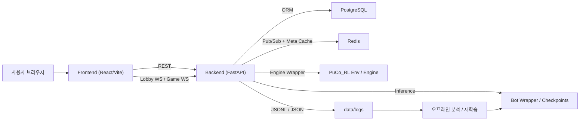
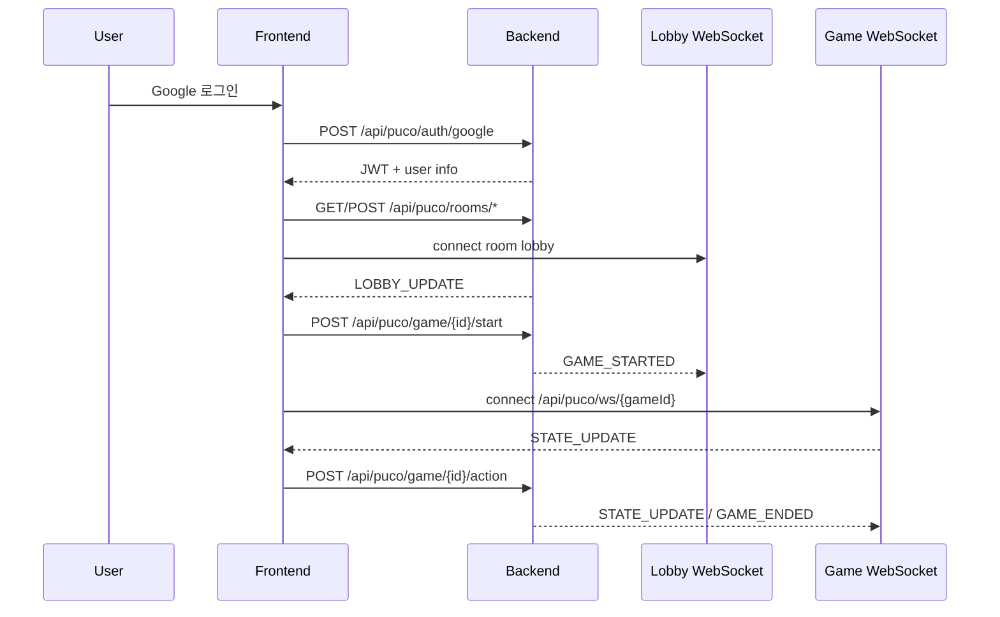
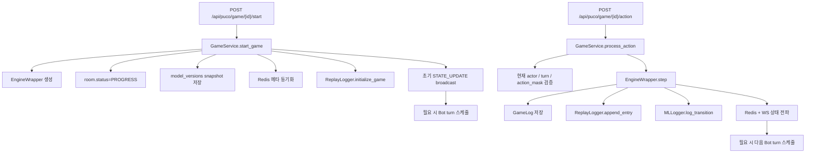

# Castone 코드베이스 인수인계 문서

작성일: 2026-04-06  
대상 독자: 다음 유지보수 담당자, 특히 전공자 대학생 수준의 새 인수인계자  
범위: `frontend`, `backend`, `PuCo_RL`, Docker 실행 구조, 실시간 아키텍처, 로그/모델 계보, MLOps 관점 주의사항

## 1. 이 저장소가 하는 일

이 프로젝트는 보드게임 Puerto Rico를 웹에서 플레이할 수 있게 만든 시스템입니다.  
핵심은 단순 웹게임이 아니라, 아래 네 층이 결합되어 있다는 점입니다.

- 사용자용 웹 UI
- FastAPI 기반 게임 서버
- Puerto Rico 규칙을 구현한 RL 환경/엔진
- 학습 가능한 봇과 그 로그를 관리하는 MLOps 파이프라인

즉, 이 저장소는 "게임 서비스"이면서 동시에 "강화학습 실험 플랫폼"입니다.

## 2. 저장소 전체 구조

```text
castone/
├── frontend/        # React/Vite SPA
├── backend/         # FastAPI 서버, 인증/방/게임/로그/API
├── PuCo_RL/         # Puerto Rico 엔진, RL 환경, 학습/평가 코드, 모델
├── data/logs/       # 게임/리플레이/학습용 로그 산출물
├── docs/            # 테스트/운영 보고서
├── error_report/    # 설계 리스크와 수정 계획 문서
└── docker-compose.yml
```

각 디렉터리의 책임은 다음처럼 이해하면 됩니다.

- `frontend`
  - 사람 플레이어가 직접 보는 화면
  - 로그인, 방 관리, 로비, 실시간 게임 상태 렌더링
- `backend`
  - 사용자 인증, 방 관리, 게임 상태 진입점
  - 엔진 호출, DB 반영, Redis 실시간 이벤트, 로그 생성
- `PuCo_RL`
  - Puerto Rico 규칙 그 자체
  - RL 훈련 환경
  - PPO/Phase PPO 기반 봇 모델과 평가 코드

## 3. 큰 그림 아키텍처



이 시스템을 이해할 때 가장 중요한 포인트는 "상태가 한 군데만 있지 않다"는 점입니다.

실제 상태는 네 군데에 분산됩니다.

- PostgreSQL: 세션, 사용자, 액션 로그의 정본 메타데이터
- Redis: 실시간 브로드캐스트와 접속 메타 상태
- 메모리 엔진: 현재 턴/마스크/보드의 실제 진행 상태
- 파일 로그: 리플레이 로그와 ML 학습용 transition 로그

이 네 층의 동기화가 이 프로젝트의 핵심 난이도입니다.

## 4. 실행 환경

루트의 [docker-compose.yml](/Users/seoungmun/Documents/agent_dev/castest/castone/docker-compose.yml) 기준으로 다음 컨테이너가 올라옵니다.

- `db`: PostgreSQL 16
- `redis`: Redis 7
- `backend`: FastAPI 앱
- `frontend`: Vite dev server
- `adminer`: DB 확인용

기본 포트:

- Frontend: `127.0.0.1:3000`
- Backend: `127.0.0.1:8000`
- PostgreSQL: `127.0.0.1:5432`
- Redis: `127.0.0.1:6379`
- Adminer: `127.0.0.1:8080`

## 5. Frontend 상세 설명

### 5.1 프론트의 역할

프론트는 단순 렌더러가 아닙니다.  
실제로는 아래를 모두 담당합니다.

- OAuth 로그인
- JWT 보관
- 방 생성/조회/입장
- 로비 WebSocket 연결
- 게임 WebSocket 연결
- phase별 액션 버튼 활성화
- Mayor 같은 복합 상호작용 UI 관리
- 최종 점수 조회

핵심 진입점:

- [frontend/src/main.tsx](/Users/seoungmun/Documents/agent_dev/castest/castone/frontend/src/main.tsx)
- [frontend/src/App.tsx](/Users/seoungmun/Documents/agent_dev/castest/castone/frontend/src/App.tsx)

### 5.2 프론트 구조를 읽는 방법

현재 프론트는 React Router 같은 외부 라우팅보다 `App.tsx` 내부 상태 전이를 중심으로 움직입니다.

주요 화면 상태:

- `loading`
- `login`
- `home`
- `rooms`
- `join`
- `lobby`
- `game`

이 구조는 새 인수인계자에게 장단점이 있습니다.

- 장점: 진입 흐름이 한 파일에 모여 있어 추적이 쉽다
- 단점: 기능이 커질수록 한 파일의 결합도가 높아진다

### 5.3 프론트 통신 흐름



### 5.4 프론트에서 중요한 계약

가장 중요한 계약은 action index입니다.

프론트는 예를 들면 "설탕 판매 버튼"을 직접 API로 보내지 않습니다.  
정수 index로 바꿔서 서버에 보냅니다.

이 계약은 다음 세 곳이 동시에 맞아야 합니다.

- [frontend/src/App.tsx](/Users/seoungmun/Documents/agent_dev/castest/castone/frontend/src/App.tsx)
- [backend/app/services/state_serializer.py](/Users/seoungmun/Documents/agent_dev/castest/castone/backend/app/services/state_serializer.py)
- [PuCo_RL/env/pr_env.py](/Users/seoungmun/Documents/agent_dev/castest/castone/PuCo_RL/env/pr_env.py)

여기서 하나라도 어긋나면 다음 문제가 생깁니다.

- 버튼은 정상처럼 보이는데 서버가 다른 행동으로 해석
- RL 모델이 학습한 action 의미와 실서빙 action 의미가 달라짐
- 리플레이 로그가 사람이 읽는 의미와 달라짐

### 5.5 프론트 테스트/운영 관점 주의점

- `i18n.ts`가 import 시점에 `localStorage`를 읽습니다.
  - 브라우저 환경이 아닌 테스트에서 깨질 수 있습니다.
- `App.tsx`가 너무 많은 책임을 갖고 있습니다.
  - 화면 변경 시 인증, phase, API side effect가 같이 흔들릴 수 있습니다.
- SSE 훅이 남아 있지만 현재 채널 모드의 주력은 WebSocket입니다.

## 6. Backend 상세 설명

### 6.1 백엔드의 역할

백엔드는 단순 REST API 서버가 아닙니다.  
실제로는 "실시간 멀티플레이 세션 관리자 + 엔진 오케스트레이터 + 로그 수집기" 역할을 합니다.

핵심 파일:

- [backend/app/main.py](/Users/seoungmun/Documents/agent_dev/castest/castone/backend/app/main.py)
- [backend/app/api/channel/room.py](/Users/seoungmun/Documents/agent_dev/castest/castone/backend/app/api/channel/room.py)
- [backend/app/api/channel/game.py](/Users/seoungmun/Documents/agent_dev/castest/castone/backend/app/api/channel/game.py)
- [backend/app/api/channel/auth.py](/Users/seoungmun/Documents/agent_dev/castest/castone/backend/app/api/channel/auth.py)
- [backend/app/services/game_service.py](/Users/seoungmun/Documents/agent_dev/castest/castone/backend/app/services/game_service.py)
- [backend/app/services/ws_manager.py](/Users/seoungmun/Documents/agent_dev/castest/castone/backend/app/services/ws_manager.py)

### 6.2 백엔드 주요 레이어

#### API 레이어

주요 채널 API는 다음 성격으로 나뉩니다.

- 인증
  - Google 토큰 검증
  - JWT 발급
- 방 관리
  - 방 생성
  - 목록 조회
  - 입장/퇴장
  - 봇전 생성
- 게임 관리
  - 시작
  - 액션 처리
  - Mayor 분배
  - 봇 추가
  - 최종 점수 조회
- WebSocket
  - 로비 전용
  - 게임 전용

#### 서비스 레이어

- `GameService`
  - 게임 시작과 액션 처리의 핵심 오케스트레이터
- `LobbyConnectionManager`
  - 로비 소켓 연결 관리
- `ConnectionManager`
  - 게임 소켓 연결 및 Redis 브로드캐스트
- `BotService`
  - 현재 엔진 상태를 봇 입력으로 변환하고 액션 추론
- `ModelRegistry` / `AgentRegistry`
  - 어떤 bot_type이 어떤 체크포인트/래퍼로 연결되는지 결정

#### 영속화 레이어

- PostgreSQL
  - `users`
  - `games`
  - `game_logs`
- Redis
  - 접속 상태
  - 게임 메타
  - 실시간 pub/sub
- 파일 로그
  - `data/logs/games/*.jsonl`
  - `data/logs/replay/*.json`

### 6.3 백엔드 핵심 데이터 모델

[backend/app/db/models.py](/Users/seoungmun/Documents/agent_dev/castest/castone/backend/app/db/models.py) 의 핵심 모델:

- `User`
  - Google 계정 기반 사용자
- `GameSession`
  - 방/게임 세션 메타데이터
  - `status`, `players`, `model_versions`, `host_id`
- `GameLog`
  - 각 액션의 전후 상태와 액션 기록

중요한 설계 포인트:

- 실제 보드 엔진 전체가 DB에 저장되는 구조는 아님
- DB에는 세션 메타와 액션 로그가 남고, 실제 진행 상태는 런타임 엔진이 쥡니다

### 6.4 게임 진행 흐름



### 6.5 EngineWrapper의 의미

[backend/app/engine_wrapper/wrapper.py](/Users/seoungmun/Documents/agent_dev/castest/castone/backend/app/engine_wrapper/wrapper.py) 는 백엔드와 RL 환경 사이의 어댑터입니다.

역할:

- RL 환경 `PuertoRicoEnv` 초기화
- 현재 state와 action mask를 JSON 직렬화 가능한 형태로 제공
- step 이후 reward/done/info를 모아 서비스 레이어가 쓰기 쉽게 반환
- round/step count 관리

즉, FastAPI 서버는 직접 RL 엔진 내부 객체를 다루지 않고 `EngineWrapper`를 통해 접근합니다.

### 6.6 Redis의 역할

[backend/app/core/redis.py](/Users/seoungmun/Documents/agent_dev/castest/castone/backend/app/core/redis.py) 는 sync/async Redis 클라이언트를 분리해서 제공합니다.

Redis는 여기서 주로 두 가지 역할을 합니다.

- 실시간 이벤트 브로드캐스트 매개
- 게임 메타 및 접속 상태 저장

예시:

- `game:{id}:events`
- `game:{id}:meta`
- `game:{id}:players`

### 6.7 인증 구조

[backend/app/api/channel/auth.py](/Users/seoungmun/Documents/agent_dev/castest/castone/backend/app/api/channel/auth.py) 의 흐름은 다음과 같습니다.

1. 프론트가 Google credential을 서버에 전달
2. 서버가 Google 공개키 기준으로 토큰 검증
3. `users` 테이블 upsert
4. 서버 JWT 발급
5. 프론트는 이후 Bearer 토큰 사용

추가로 일부 legacy endpoint는 `X-API-Key`를 같이 사용합니다.

## 7. PuCo_RL 상세 설명

### 7.1 이 디렉터리의 역할

`PuCo_RL`은 이 프로젝트의 규칙 엔진이자 학습 환경입니다.  
웹 서버는 여기 없이 돌아갈 수 없습니다.

핵심 하위 구조:

- `env/`
  - 게임 엔진, PettingZoo 환경
- `agents/`
  - PPO/Phase PPO 모델과 서빙 래퍼
- `train/`, 상위 학습 스크립트들
  - self-play 학습
  - 리그 학습
  - phase PPO 계열
- `evaluate/`
  - 모델 평가 및 리플레이
- `models/`
  - 체크포인트와 메타데이터
- `tests/`
  - RL 쪽 단위 테스트

### 7.2 엔진과 환경의 차이

신규 인수인계자가 가장 헷갈리기 쉬운 부분입니다.

- `env/engine.py`
  - Puerto Rico 규칙을 구현한 순수 게임 엔진
- `env/pr_env.py`
  - 그 엔진을 RL 훈련용 환경으로 감싼 PettingZoo AEC 환경

웹 서버는 `pr_env.py` 기반 환경을 쓰되, 사용자에게는 RL 환경처럼 보이지 않게 감싸서 사용합니다.

### 7.3 관측/행동 공간

[PuCo_RL/env/pr_env.py](/Users/seoungmun/Documents/agent_dev/castest/castone/PuCo_RL/env/pr_env.py) 에서 action space는 `Discrete(200)` 입니다.

즉, 행동은 항상 `0~199` 중 하나입니다.  
하지만 실제 사용되는 구간은 phase별로 일부만 채워집니다.

예시:

- `0~7`: 역할 선택
- `8~15`: Settler/Pass
- `16~38`: Builder
- `39~43`: Trader
- `44~68`: Captain 관련
- `69~92`: Mayor 배치
- `93~97`: Craftsman privilege
- `106~110`: Warehouse 보관

관측은 다음 두 축으로 구성됩니다.

- `observation`
  - global state
  - players state
- `action_mask`
  - 현재 가능한 행동만 1로 표시

이 설계를 이해해야 하는 이유:

- UI 액션 활성화 로직
- 봇 추론
- GameLog 해석
- 리플레이 뷰어
- 학습용 배치 생성

모두 action mask에 의존하기 때문입니다.

### 7.4 모델 구조

[PuCo_RL/agents/ppo_agent.py](/Users/seoungmun/Documents/agent_dev/castest/castone/PuCo_RL/agents/ppo_agent.py) 기준으로 현재 눈에 띄는 주요 모델은 두 계열입니다.

- `Agent`
  - Residual MLP 기반 PPO actor-critic
- `PhasePPOAgent`
  - phase별 actor head를 분리한 변형

의도는 다음과 같습니다.

- 표준 PPO는 모든 phase를 하나의 actor head로 처리
- Phase PPO는 역할 선택, 정착, 건설, 시장, 선장 등을 별도 head로 나눠 처리

### 7.5 서빙 래퍼

[PuCo_RL/agents/wrappers.py](/Users/seoungmun/Documents/agent_dev/castest/castone/PuCo_RL/agents/wrappers.py) 와 [backend/app/services/agent_registry.py](/Users/seoungmun/Documents/agent_dev/castest/castone/backend/app/services/agent_registry.py) 를 같이 봐야 합니다.

실전 흐름:

1. 백엔드가 `bot_type`을 받음
2. `AgentRegistry`가 어떤 wrapper와 어떤 checkpoint를 쓸지 결정
3. `BotService`가 현재 엔진 state를 flatten
4. wrapper가 모델 추론
5. action index 반환

즉, RL 코드와 웹 서비스가 직접 결합되는 지점은 wrapper/registry 계층입니다.

### 7.6 학습 스크립트 구조

대표 학습 스크립트:

- [PuCo_RL/train/train_ppo_selfplay_server.py](/Users/seoungmun/Documents/agent_dev/castest/castone/PuCo_RL/train/train_ppo_selfplay_server.py)
- [PuCo_RL/train_phase_ppo_selfplay_server.py](/Users/seoungmun/Documents/agent_dev/castest/castone/PuCo_RL/train_phase_ppo_selfplay_server.py)
- [PuCo_RL/train_hppo_selfplay_server.py](/Users/seoungmun/Documents/agent_dev/castest/castone/PuCo_RL/train_hppo_selfplay_server.py)

이 중 실제로 현재 코드와 가장 잘 정렬되어 있는 것은 PPO/Phase PPO 계열입니다.

HPPO 쪽은 문서와 코드의 명칭이 어긋난 부분이 있어, 바로 학습 파이프라인을 신뢰하면 안 됩니다.

## 8. MLOps 관점에서 봐야 할 구조

### 8.1 왜 MLOps 관점이 필요한가

이 프로젝트는 "게임 서버"와 "모델 서빙"이 같은 백엔드 프로세스 안에 있습니다.  
그래서 일반 웹 서비스보다 다음 질문이 더 중요합니다.

- 지금 어떤 모델이 실제 게임에서 사용되었는가?
- 그 게임 로그는 어떤 체크포인트와 연결되는가?
- 나중에 재학습할 때 어떤 데이터가 정본인가?
- 리플레이 로그, DB 로그, transition 로그가 서로 일치하는가?

### 8.2 현재 모델 계보 추적 구조

[backend/app/services/model_registry.py](/Users/seoungmun/Documents/agent_dev/castest/castone/backend/app/services/model_registry.py) 는 체크포인트 메타데이터를 해석합니다.

핵심 개념:

- `ModelArtifact`
  - 모델 family, architecture, obs_dim, action_dim, metadata source 등을 담는 구조
- sidecar JSON
  - 체크포인트 옆 JSON 메타데이터
- bootstrap profile
  - sidecar가 없어도 일부 PPO 모델은 규칙 기반으로 메타데이터를 유도

이 메타데이터는 게임 시작 시 `room.model_versions`에 snapshot으로 저장됩니다.

즉, "이 게임에서 어떤 모델을 썼는지"를 나중에 볼 수 있게 하려는 설계입니다.

### 8.3 게임 중 생성되는 로그

현재 주된 로그는 세 종류입니다.

#### 1. DB 액션 로그

- 저장 위치: `game_logs` 테이블
- 내용: action 전후 상태, step, actor, summary
- 목적: 서버 정본 기록

#### 2. Replay 로그

- 구현: [backend/app/services/replay_logger.py](/Users/seoungmun/Documents/agent_dev/castest/castone/backend/app/services/replay_logger.py)
- 저장 위치: `data/logs/replay/{game_id}.json`
- 목적:
  - 리플레이 재생
  - 사람이 읽는 경기 해설
  - 디버깅

#### 3. ML transition 로그

- 구현: [backend/app/services/ml_logger.py](/Users/seoungmun/Documents/agent_dev/castest/castone/backend/app/services/ml_logger.py)
- 저장 위치: `data/logs/games/{game_id}.jsonl`
- 목적:
  - `(state, action, reward, next_state)` 수집
  - 오프라인 RL 재학습 데이터

### 8.4 MLOps 관점 핵심 위험

현재 구조에서 꼭 기억해야 할 리스크:

1. transition 로그가 DB commit과 완전히 원자적으로 묶여 있지 않음  
2. 게임 엔진이 메모리 기반이라 재시작 시 정본 재구성이 어려움  
3. sidecar 메타데이터가 없는 모델은 bootstrap/profile 추론에 의존  
4. HPPO 계열은 코드 심볼 불일치가 있어 서빙/학습의 일관성이 떨어질 수 있음  

즉, "게임이 끝났다"와 "훈련 데이터가 일관되게 남았다"는 현재 동일한 보장이 아닙니다.

### 8.5 추천 MLOps 개선 방향

장기적으로는 다음 구조가 이상적입니다.

- 모델 등록소 규격 통일
  - 모든 체크포인트에 sidecar JSON 필수
- outbox 패턴 도입
  - DB commit 성공 후 transition/replay 비동기 소비
- 데이터 버전 명시
  - `schema_version`, `obs_dim`, `action_dim`, `phase mapping`, `reward shaping config`
- 재현 가능한 서빙 기록
  - 게임마다 `model_versions`, `commit hash`, `env config`, `reward weights` snapshot 저장
- 학습/서빙 계약 테스트
  - action index, obs_dim, architecture compatibility를 CI에서 검증

## 9. 현재 구조에서 특히 중요한 설계 포인트

### 9.1 정본(Source of Truth)이 하나가 아님

이 프로젝트는 흔한 CRUD 서비스처럼 DB 하나만 보면 안 됩니다.

정본 후보가 여러 개 있습니다.

- 세션 메타: PostgreSQL
- 실시간 진행 상태: 메모리 엔진
- 접속/브로드캐스트 상태: Redis
- 재학습 데이터: JSONL
- 사람 친화적 경기 재현: replay JSON

문제는 서로 lifecycle이 다르다는 것입니다.

예:

- 서버 재시작 시 DB는 남지만 메모리 엔진은 사라짐
- commit 실패 시 DB는 롤백되어도 로그 파일은 일부 남을 수 있음
- WebSocket disconnect가 곧 게임 종료를 의미하지는 않음

### 9.2 아키텍처적으로 이해해야 할 핵심 경계

새 인수인계자는 아래 경계를 명확히 잡으면 훨씬 빨리 적응할 수 있습니다.

- UI 경계
  - 프론트는 "상태를 보여주고 action index를 보낸다"
- API 경계
  - 백엔드는 인증과 세션, 권한, 순서를 검증한다
- 엔진 경계
  - 실제 규칙과 가능한 액션은 RL 환경이 결정한다
- 서빙 경계
  - bot_type과 checkpoint는 registry/wrapper가 해석한다
- 데이터 경계
  - DB/Redis/파일 로그는 동일 책임이 아니다

## 10. 이미 확인된 주요 리스크

아래는 이전 검토 및 테스트 문서와 합쳐서 중요도가 높은 항목들입니다.

### P0 수준

- 로비 WebSocket 종료가 실제 leave로 처리될 수 있는 문제
- 종료된 게임이 action을 계속 받을 수 있는 문제

### P1 수준

- 진행 중 게임 엔진이 프로세스 메모리에만 있어 재시작/스케일아웃에 취약
- ML transition 로그와 DB commit의 정합성 문제
- HPPO 학습 경로의 `HierarchicalAgent` 심볼 불일치

추가 참고:

- [docs/docker_test_report_2026-04-05.md](/Users/seoungmun/Documents/agent_dev/castest/castone/docs/docker_test_report_2026-04-05.md)
- [error_report/2026-04-05_error_priority_tdd_architecture_plan.md](/Users/seoungmun/Documents/agent_dev/castest/castone/error_report/2026-04-05_error_priority_tdd_architecture_plan.md)

## 11. 다음 인수인계자가 처음 1주일 동안 해야 할 일

### 1단계. 시스템을 실행해 보기

```bash
docker compose up -d --build
```

그 다음 아래를 직접 확인하는 것이 좋습니다.

- 로그인 가능 여부
- 방 생성/입장
- 봇전 시작
- 실시간 게임 화면 갱신
- 종료 후 결과 화면 표시

### 2단계. 코드 읽기 순서 추천

읽는 순서는 아래가 가장 효율적입니다.

1. [frontend/src/App.tsx](/Users/seoungmun/Documents/agent_dev/castest/castone/frontend/src/App.tsx)
2. [backend/app/main.py](/Users/seoungmun/Documents/agent_dev/castest/castone/backend/app/main.py)
3. [backend/app/api/channel/room.py](/Users/seoungmun/Documents/agent_dev/castest/castone/backend/app/api/channel/room.py)
4. [backend/app/api/channel/game.py](/Users/seoungmun/Documents/agent_dev/castest/castone/backend/app/api/channel/game.py)
5. [backend/app/services/game_service.py](/Users/seoungmun/Documents/agent_dev/castest/castone/backend/app/services/game_service.py)
6. [backend/app/engine_wrapper/wrapper.py](/Users/seoungmun/Documents/agent_dev/castest/castone/backend/app/engine_wrapper/wrapper.py)
7. [PuCo_RL/env/pr_env.py](/Users/seoungmun/Documents/agent_dev/castest/castone/PuCo_RL/env/pr_env.py)
8. [PuCo_RL/agents/ppo_agent.py](/Users/seoungmun/Documents/agent_dev/castest/castone/PuCo_RL/agents/ppo_agent.py)

이 순서로 읽으면 "화면 -> API -> 서비스 -> 엔진 -> 모델" 흐름이 머리에 잡힙니다.

### 3단계. 테스트를 직접 돌려 보기

백엔드:

```bash
docker compose exec backend pytest
```

프론트:

```bash
cd frontend
npm run test
```

테스트 실패가 나왔을 때는 단순히 수정하지 말고, 먼저 그 실패가 "계약 불일치"인지 "테스트 환경 문제"인지 구분하는 습관이 중요합니다.

## 12. 이 저장소를 안전하게 고치는 방법

### 12.1 우선순위 기준

수정 우선순위는 보통 다음 순서가 맞습니다.

1. 정합성 붕괴
   - 게임 종료/퇴장/권한/turn validation
2. 상태 복구 불가
   - 메모리 엔진 의존
3. 데이터 계보
   - DB 로그와 ML 로그 불일치
4. 구조 리팩터링
   - App.tsx 분리, registry 정리
5. 성능/미관 개선

### 12.2 TDD 관점으로 보면

새 기능보다 먼저 계약 테스트를 늘리는 편이 좋습니다.

우선 테스트해야 할 계약:

- action index 계약
- 종료된 게임 action 차단
- 로비 종료와 실제 leave 분리
- bot_type별 checkpoint 로딩 계약
- replay/transition/DB 로그의 동시성 정합성

## 13. 추천 리팩터링 로드맵

### 단기

- `App.tsx` 분리
- `i18n.ts` 브라우저 가드 추가
- 종료 상태 가드 추가
- lobby/game socket lifecycle 정리

### 중기

- active engine 복구 전략 설계
- transition logging outbox화
- model metadata schema 강제
- HPPO 명명 체계 정리

### 장기

- 게임 state snapshotting
- 멀티워커/수평 확장 가능한 아키텍처
- 학습 데이터 레이크/버전 관리
- 자동 모델 검증 파이프라인

## 14. 마지막 조언

이 저장소는 "웹 프론트", "실시간 서버", "게임 규칙 엔진", "강화학습 코드"가 한 프로젝트에 섞여 있어서 처음 보면 복잡하게 느껴질 수 있습니다.  
하지만 실제로는 아래 한 문장으로 요약됩니다.

"프론트가 action index를 보내고, 백엔드가 엔진을 한 스텝 진행시키고, 그 결과를 사람용 UI와 모델용 로그 양쪽으로 남긴다."

이 문장을 기준으로 보면 대부분의 코드가 제자리를 찾습니다.

처음부터 모든 파일을 이해하려고 하지 말고, 항상 아래 질문을 기준으로 읽는 것을 추천합니다.

- 이 상태는 어디가 정본인가?
- 이 값은 UI용인가, 엔진용인가, 학습용인가?
- 이 로직은 사람이 플레이할 때 필요한가, 봇 추론을 위해 필요한가?
- 지금 바꾸는 코드가 action contract를 깨지 않는가?

이 네 가지 질문만 유지해도 유지보수 실수의 상당수를 줄일 수 있습니다.
